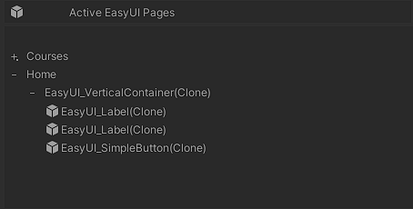

# EasyUI #

EasyUI é uma package desenvolvida com o objetivo de acelerar o processo de desenvolvimento de telas dentro dos projetos da Unity. Seu foco é na construção das telas através de códigos, bastatante inspirado em como a interface do usuário dos aplicativos desenvolvidos em Flutter são feitos.

# Summary #

- [How does it works](#how-does-it-works)
    - [Navigating between pages already made for you](#navigating-between-pages-already-made-for-you)
    - [Creating pages](#creating-pages)
        - [Implementing a new page](#implementing-a-new-page)
        - [Displaying this page](#displaying-this-page)
    - [Building your page: UIElement](#building-your-page-uielement)
        - [Analisando seus parâmetros](#analisando-seus-parâmetros)
    - [Building your page: UIContainer](#building-your-page-uicontainer)
        - [Analisando seus parâmetros](#analisando-seus-parc3a2metros-1)
    - [Building your page: ScreenViewer](#building-your-page-screenviewer)
    - [General Layout](#general-layout)
    - [Making your own uielements](#making-your-own-uielements)
    - [Making your own uicontainer](#making-your-own-uielements)
    - [The EasyUI.Library](#the-easyuilibrary)
- [License](#license)


# How does it works #

## Navigating between pages already made for you ##

EasyUI já apresenta uma navegação entre paineis implementada. Não é complexo e ja cobre o suficente para realizar a construção de mais de uma página dentro do projeto. Ajudando o usuário e focar somente no desenvolvimento das páginas e não em "como navegar entre elas"

## Creating pages ##

O sistema aprensenta as ``EasyUIPage``, que são containers onde irão ser programados todos os comandos necessários para a construção da página desejada. Cada página do seu projeto será uma ``EasyUIPage`` diferente. Toda a construção da págin é realizada dentro de uma função chamada ``OnDrawPage``.

Tendo a sua página implementada e caso queira abrir-la, será necessário adicionar uma instância desta página dentro da pilha de páginas, através do comando `` EasyUIPage.Add(your_page_here); ``
<br>
<br>
Abaixo mostra um pequeno exemplo de como implementar uma nova página para o seu projeto.
<br>
<br>

### Implementing a new page
```C#

//Don't forget to include the EasyUI.Page
using EasyUI.Page;

public class EasyUIPage_MainMenu : EasyUIPage
{

    //Constructor for initializing any additional properties of your classes
    public EasyUIPage_MainMenu(string name) : base(name) 
    {
    }

    //Where all the magic happens 🪄
    //Here you will draw your page adding the necessary commands to display your user interface
    public override List<string> OnDrawPage()
    {
        //Drawn your page here!!
    }
}
```

### Displaying this page

```C#

using UnityEngine;

public class YouControllerClass : Monobehaviour
{
    void Start()
    {
        EasyUIPage.Add(new EasyUIPage_MainMenu(name: "my page!"));
    }
}

```
Ao chamar esse comando, o sistema adiciona essa nova instância na pilha de páginas. O sistema por debaixo dos panos realiza todo processo de transição da página atual para a recém adicionada na pilha. Tendo isso em vista, é possível também fazer o processo inverso, fechar uma página através da função ``Close()``. Ao chamar essa função, o sistema remove a página do topo da pilha.

## Building your page: UIElement

``UIElements`` são os componentes que irão compor a sua tela, e terão a função de fornecer informações e suportar interaçãos do usuário. Existem diversos ``UIElements`` dentro  desta package que ja suprem as necessidades básicas de uma tela. Estes elementos tem em sua superclasse o campo ``ElementData`` que serve para conter o valor que este elemento irá representar. Então digamos que queira criar um texto na tela com o valor ``Hello World``, o seu ``ElementData`` será o responsável por conter este valor. Todos os elementos de interface terao o seu ``ElementData`` definido, seja um botão ou um texto. Sua definição ocorre no momento em que o elemento é instanciado na tela, através da função ``SetupElement(ElementData data, Dictionary<string, object> args = null)``. É possível criar seus próprios ``UIElement`` conforme seu projeto for necessitando. Please refer to [Making your own uielements](#making-your-own-uielements)

Para construir a sua página contendo seus elementos de interface todos os comandos terão que ser feitos dentro da função ``OnDrawPage()``. Ao abrir uma nova página, o sistema executa essa função uma vez que a página está pronta para ser desenhada. Existem alguns elementos básicos que podem ser adicionados quando estiver montando a sua página, mas saiba que todos eles serão construídos através da funçao ``AddUIElement()``, da classe ``BuilderUI``. Essa função é uma função genérica, e que recebe alguns parâmetros. Vejamos sua representação abaixo:

```CS
Builder.AddUIElement<UIElementType, ElementData>(ElementData data, UIContainer parent = null, Dictionary<string, object> args = null,Action<UIElementType> onElementCreated = null, BuildSettings settings = null);
```

A função apresentada acima cria um elemento de interface na tela. Esse elemento sempre será derivado da superclasse ``UIElement<ElementType, DataType>``. Todas as classes derivadas de ``UIElement<ElementType, DataType>`` apresentam o dado que irá representar, esse dado vai ser o que será apresentado na tela ou executado quando o uisário interagir com o elemento. O tipo de elemento a ser criado e o dado a ser utilizado serão especificados na hora da chamada da função genérica. E O tipo desse dado que o elemento de interface irá suportar é definido durante a implementação de sua classe.

### Analisando seus parâmetros

* ``ElementData data``: Qual será o valor do dado que o elemento vai conter.
* ``UIContainer parent``: Parâmetro opcional que define onde que este elemento vai ser criado. [See about UIContainer](#building-your-page-uicontainer). Caso seja nulo, o elemento será instanciado dentro da [``ScreenViewer``](#building-your-page-screenviewer)  
* ``Dictionary<string, object> args``: Parâmetro opcional que define todos os atributos do ``UIElement`` instanciado na tela.
* ``Action<UIElementType> OnElementCreated``: Callback opcional que é disparada logo depois que o elemento é instanciado na tela.
* ``BuildSettings settings``: Parâmetro opcional que apresenta algumas configurações de como o processo de criação dele deve acontecer.


## Building your page: UIContainer

``UIContainer`` como seu nome ja nos diz, é responsável por conter um conjunto de ``UIElements``. São blocos que irão compor a sua página, seja uma cabeçalho, footer, um menu, uma página com scrollview e entre outras várias possibilidades. ``UIContainer`` tem também como objetivo facilitar a estruturação de sua página. Please refer to Please refer to [Making your own uicontainer](#making-your-own-uicontainers).

Para adicionar um ``UIContainer`` dentro da sua página, assim como os ``UIElements``, seus comandos de criação devem ser realizados dentro da função ``OnDrawnPage()``, da classe ``BuilderUI``. O comando a ser chamado deverá ser o ``AddUIContainer``. Vejamos sua representação abaixo:


```CS
BuilderUI.AddContainer<UIContainerType>(UIContainer parent, Dictionary<string, object> args = null, Action<UIContainerType> onElementCreated = null);
```

### Analisando seus parâmetros

* ``ElementData parent``: É possível aninhar ``UIContainers``.
* ``Dictionary<string, object> args``: Parâmetro opcional que define todos os atributos do ``UIContainer`` instanciado na tela.
* ``Action<UIElementType> OnElementCreated``: Callback opcional que é disparada logo depois que o elemento é instanciado na tela.

## Building your page: ScreenViewer

Todos os elementos são criados dentro de um ``UIContainer`` raiz chamado de ``ScreenViewer``. Esse container é instanciado por padrão quando o sistema cria uma página. É com este elemento que pode configurar o ``padding`` do seu aplicativo. Para definir o ``padding``, é nessecário chamar a função ``SetupScreenViewer(float padding)``, passando o valor desejado no argumento.

## General Layout

De modo geral, uma página irá conter uma estrutura hierarquizada de ``UIContainer`` e ``UIElement``. Essa estrutura pode ser observada no asset ``RuntimeDataContainer``, como demonstra a imagem abaixo:




## Making your own uielements

É possível criar ``UIElements`` personalizados, com objetivo de suprir as necessidades do seu projeto. Vamos analisar a implemetação de um elemento já presente nesta package, o elemento ``Label``:

```CS
namespace EasyUI.Library
{
    public class Label : UIElement<string>
    {
        [SerializeField]
        protected TextMeshProUGUI label;

        public override void SetupElement(string data, Dictionary<string, object> args = null)
        {
            base.SetupElement(data, args);

            label.text = data;
        }

        protected override void ApplyArgs(Dictionary<string, object> args = null)
        {
            if (args.TryGetValue("fontSize", out object fontSize)) 
            {
                label.fontSize = (float)fontSize;
            }

            if (args.TryGetValue("font", out object font)) 
            {
                label.font = Resources.Load<TMP_FontAsset>($"Fonts/{(string)font}");
            }

            if (args.TryGetValue("fontStyle", out object fontStyle)) 
            {
                label.fontStyle = (FontStyles)fontStyle;
            }

            if (args.TryGetValue("color", out object color)) 
            {
                label.color = (Color)color;
            }

            if (args.TryGetValue("alignment", out object alignment)) 
            {
                label.alignment = (TextAlignmentOptions)alignment;
            }

            if (args.TryGetValue("lineSpacing", out object lineSpacing)) 
            {
                label.lineSpacing = (float)lineSpacing;
            }

            base.ApplyArgs(args);
        }
    }
}
```
Como dito na seção [sobre os UIElements](#building-your-page-uielement). Seu dado é definido no momento em que é instanciado na tela. Logo, ao chamar a função ``SetupElement``, o código define qual vai ser o seu dado e em seguida atribui este dado no elemento de texto ``label``.

A função abaixo ``ApplyArgs`` estará presente em todos os ``UIElements`` presentes no projeto. Nessa função, pode ser definida algumas palavras chaves para algumas definições dos atributos do elemento. No caso de ``Label``, foram criadas atributos que ajudam a definir o estilo do texto, afetando em como ele deve ser quando for instanciado.

> **_NOTE:_** Não esqueça de chamar as classes bases das funções citadas acima, caso contrário, algumas funcionalidades do sistema não vão funcionar.

## Making your own uicontainers

É possível criar ``UIContainers`` personalizados com o objetivo de suprir as necessidades do seu projeto. Vamos analisar a implementação de um elemento já presente nesta páckage, o container ``ScrollableContainer``:

```CS
namespace EasyUI.Library
{
    [RequireComponent(typeof(ScrollRect))]
    public class ScrollableContainer : VerticalContainer
    {

        [SerializeField] protected ScrollRect scrollRect;

        public override void SetupElement(Dictionary<string, object> args = null)
        {
            scrollRect.viewport = transform.parent as RectTransform;
            scrollRect.content = transform as RectTransform;

            base.SetupElement(args);
        }

        protected override void ApplyArgs(Dictionary<string, object> args = null)
        {
            if (args.TryGetValue("movementType", out object movementType))
                scrollRect.movementType = (ScrollRect.MovementType)movementType;

            if (args.TryGetValue("inertia", out object inertia))
                scrollRect.inertia = (bool)inertia;

            if (args.TryGetValue("scrollHorizontal", out object scrollHorizontal))
                scrollRect.horizontal = (bool)scrollHorizontal;

            if(args.TryGetValue("scrollVertical", out object scrollVertical))
                scrollRect.vertical = (bool)scrollVertical;

            base.ApplyArgs(args);
        }

    }
}
```

Este container tem como objetivo possibilitar o usuário de scrollar a página. Assim como os ``UIElement``, o container também apresenta as funções ``SetupEmelement`` e ``ApplyArgs``. No exemplo acima, o container está implementando um outro cotainer chamado ``VerticalContainer``, que tem como objetivo dispor os elementos filho verticalmente. E por sua vez, essa classe herda a classe base ``UIContainer``. No final, esta classe acima irá apresentar os elementos verticalmente e será possível scrollar a página.

> **_NOTE:_** Não esqueça de chamar as classes bases das funções citadas acima, caso contrário, algumas funcionalidades do sistema não vão funcionar.

## The EasyUI.Library

Todos os elementos de interface já criados para esta pacakage poderão ser acessados dentro da namespace ``EasyUI.Library``. Abaixo estão alguns dos elementos já desenvolvidos até então:

### UIElements

- BackgroundImage
- Label
- SimpleButton
- Mask

### UIContainer

- HorizontalOrVerticalContainer
    - HorizontalContainer
        - ScrollableContainer
    - VerticalContainer
- GridContainer


# License 

EasyUI is a free software; you can redistribute it and/or modify it under the terms of the MIT license. See LICENSE for details.